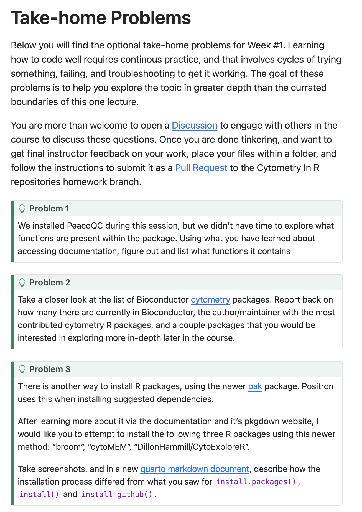
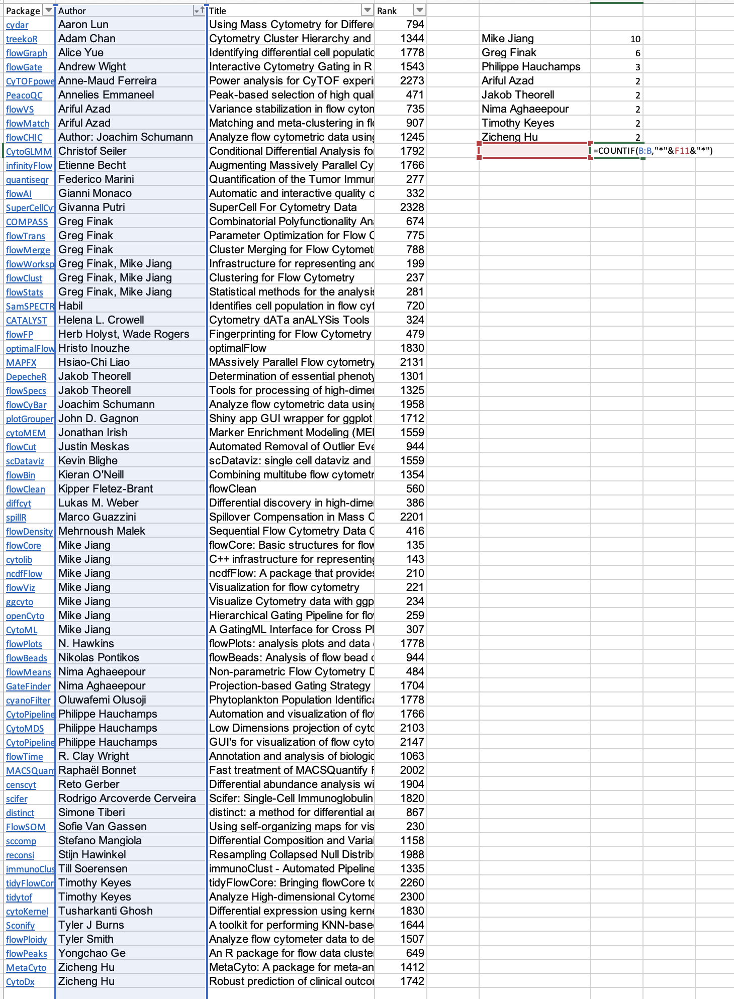
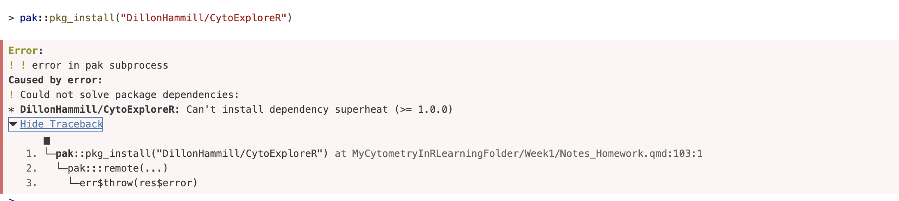
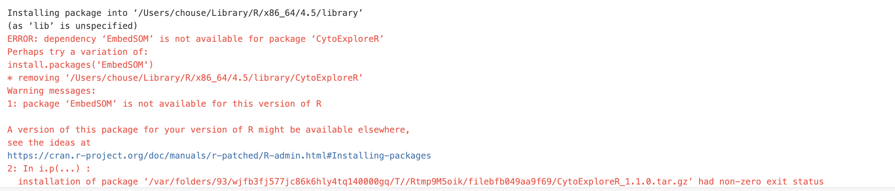

# Installing and Loading Packages

Install packages (see notes). Remember all require "". Load packages.

```{r}
#| warning: FALSE
#| message: FALSE
#load CRAN packages: install.packages("")
library(dplyr)
library(stringr)
library(purrr)
library(ggplot2)
library(tidyr)
library(xml2)
library(lubridate)
library(httr2)
library(devtools)
library(plotly)
library(Rtsne)
library(uwot)

#load bioconductor packages: install("")
library(PeacoQC)
library(flowCore)
library(flowWorkspace)
library(ggcyto)
library(openCyto)
library(FlowSOM)
library(flowGate)
library(CytoML)

#load github packages: install_github("username/package")
library(remotes)
library(CytoNorm)
library(cyCombine)
```


# Homework
Details can be found [here](https://umgcccfcsr.github.io/CytometryInR/course/01_InstallingRPackages/#take-home-problems)

See screenshot:
 


## Problem 1
What is in bioconductor package PeacoQC?

PeacoQC includes functions for flow or mass cytometry data quality control (QC) and data pre-processing. It functions in the following order: removing margins, compensating, transforming, and assessing QC, returning a QC plot and cleaned flow set in a new fcs file. 

Details can be found [here](https://www.bioconductor.org/packages/release/bioc/html/PeacoQC.html) or can be found using r:

```{r}
#| warning: FALSE
library(PeacoQC)
#load supporting documents
browseVignettes("PeacoQC")
```

```{r}
#list all functions
ls("package:PeacoQC")
```

## Problem 2

There are 69 flow cytometry packages in Bioconductor as found [here](https://www.bioconductor.org/packages/release/BiocViews.html#___FlowCytometry).

I downloaded these into excel, filtered by name, and used COUNTIF with partial name recognition (due to co-authors) to count. I didn't know the partial search functions with COUNTIF, so that was fun to learn. See screenshots:
 

I think I could do this in R, too, but I will have to come back later to try that.

Mike Jiang (10) followed by collaborator Greg Finak (6)

I would be interested in FlowCore, FlowSOM, PeacoQC, and flowMeans, which are bascially any I have heard of before. That is to say, if I hear of it, I would like to learn more. 

## Problem 3
What is in CRAN package pak? Linked [here](https://pak.r-lib.org/index.html) or [here for CRAN](https://cloud.r-project.org/web/packages/pak/index.html).

pak is a package that can install from CRAN, Bioconductor, GitHub, URLs, git repositories, and local files. It is an alternative to the install.packages("") for CRAN, install("") for Bioconductor, and the install_github("username/package") for GitHub. It is fast -- it performs HTTP queries concurrently and caches backup. It is safe -- it auto-installs missing dependencies and corrects CRAN errors. It is convenient -- it is self-contained and installs from multiple sources. 

```{r}
#| warning: FALSE
#install.packages("pak")
library(pak)

#pak::pkg_install("broom")
library(broom)

#pak::pkg_install("cytoMEM")
library(cytoMEM)

#install GitHub package "DillonHammill/CytoExploreR"
#pak::pkg_install("DillonHammill/CytoExploreR") failed, needs superheat
```

Screenshot of error 1: 
 

```{r}
#| warning: FALSE
#pak::pkg_install("superheat")
library(superheat) 
#pak::pkg_install("DillonHammill/CytoExploreR") still failed, same error

#pak::pkg_install("DillonHammill/CytoExploreR",upgrade = TRUE) failed
#pak::pkg_install("DillonHammill/CytoExploreR",dependences = NA) failed
#pak::pkg_install("DillonHammill/CytoExploreR",dependences = TRUE) failed
#pak::pkg_install("DillonHammill/CytoExploreR",ask = TRUE) failed

#is it having an issue with github?
#library(remotes)
#pak::pkg_install("DillonHammill/CytoExploreR",ask = TRUE) still failed

#pkg_deps_explain("DillonHammill/CytoExploreR", "superheat") failed
#pak(pkg = "DillonHammill/CytoExploreR")

#resorted to normal install function
#install_github("DillonHammill/CytoExploreR") failed, needs EmbedSOM
#pak::pkg_install("EmbedSOM") failed, google says dropped from CRAN
```

Screenshot of error 2:
 

```{r}
#| warning: FALSE
#pak::pkg_install("exaexa/EmbedSOM")
library(EmbedSOM)

#pak::pkg_install("DillonHammill/CytoExploreR") still failed
#install_github("DillonHammill/CytoExploreR",force = TRUE)
library(CytoExploreR)
#initially failed, but reloaded R and tried it again and it seemed to work as seen by session info below
```

```{r}
session_info()
```