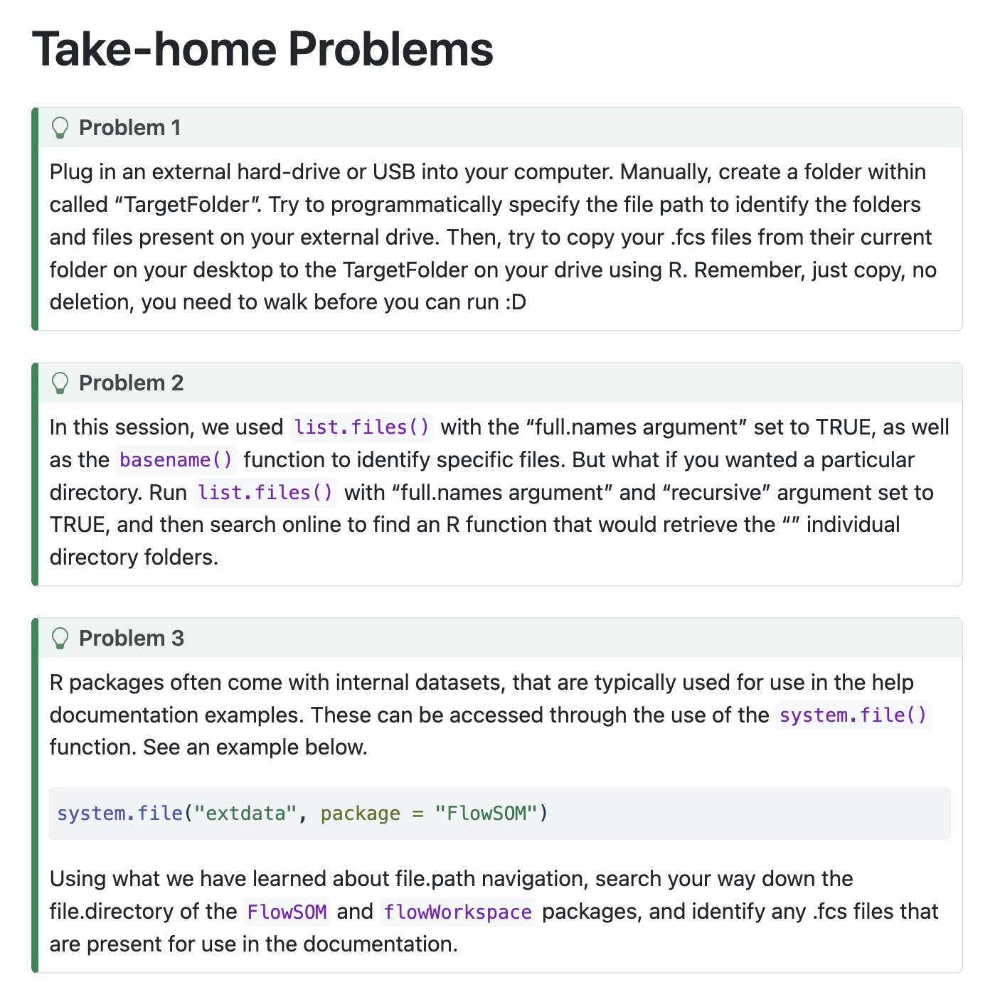

# Homework

Details can be found [here](https://umgcccfcsr.github.io/CytometryInR/course/02_FilePaths/)

See screenshot:
 


## Problem 1
I couldn't figure out a way to find my USB without using the / in "/Volumes". I wanted to make this available to non-Macs, but when I dropped the /, I couldn't reach Volumes anymore.

```{r}
#| warning: FALSE
#Create folder on FC USB
list.files(path = "/Volumes",full.names=TRUE, recursive = FALSE)
NewUSBFolderLocation <- file.path("/Volumes", "FC", "TargetFolder")
if (!dir.exists(NewUSBFolderLocation)){
    dir.create(NewUSBFolderLocation)
}
```


```{r}
#| warning: FALSE
#| message: FALSE
#identify file location
DataLocation <- file.path("Week2", "data")
fcsfiles<-list.files(path = DataLocation, pattern = ".fcs", full.names=TRUE, recursive=FALSE)
usbfiles<-list.files(path = NewUSBFolderLocation, pattern = ".fcs", full.names=TRUE, recursive=FALSE)
if (length(usbfiles)==0){
    file.copy(from=fcsfiles, to=NewUSBFolderLocation)
}

```


## Problem 2

Split path into individual folders

```{r}
getwd()
#list.dirs(path=".",full.names=TRUE, recursive = TRUE) this lists but doesn't separate
path<-file.path("Week2","data","target")
#found here https://stackoverflow.com/questions/29214932/split-a-file-path-into-folder-names-vector
split_path <- function(x) if (dirname(x)==x) x else c(basename(x),split_path(dirname(x)))
split_path(path)
split_path("~")
split_path(getwd())
```


## Problem 3

Find fcs files in FlowSOM and flowWorkspace

```{r}
#| warning: FALSE
#| message: FALSE
library(FlowSOM)
system.file("extdata", package = "FlowSOM")
extpath<-file.path(system.file("extdata", package = "FlowSOM"))
list.files(extpath,full.names=TRUE, recursive = FALSE)
list.files(extpath,pattern = ".fcs",full.names=TRUE, recursive = FALSE)

library(flowWorkspace)
extpath2<-file.path(system.file("extdata", package = "FlowSOM"))
list.files(extpath2,full.names=TRUE, recursive = FALSE)
list.files(extpath2,pattern = ".fcs",full.names=TRUE, recursive = FALSE)

```

