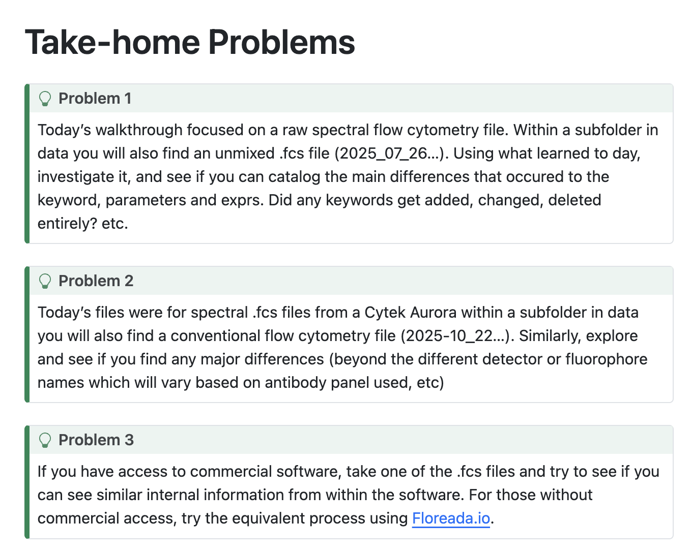
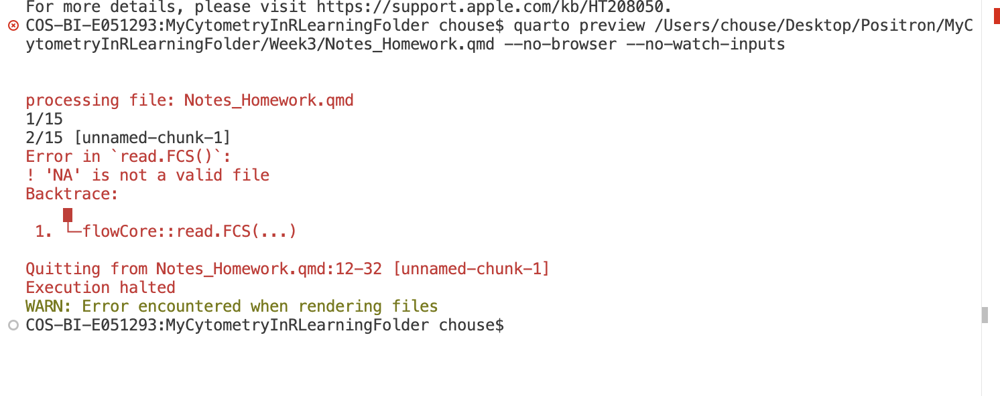

# Homework
Details can be found [here](https://umgcccfcsr.github.io/CytometryInR/course/03_InsideFCSFile/)

See screenshot:
 


## Problem 1

```{r}
#| warning: FALSE
#| message: FALSE
getwd()
fcsfolder <- file.path("Week3", "data")
fcs_files <- list.files(fcsfolder, pattern=".fcs", full.names=TRUE)
File<-fcs_files[1]

library(flowCore)
#flowFrame3<-read.FCS(filename=File, transformation = FALSE, truncate_max_range = FALSE)
#flowFrame3

#can also click in session, on matrix symbol
#exprs3 <- flowFrame3@exprs
#head(exprs3, 10)

#MetaData3 <- flowFrame3@parameters@varMetadata
#head(MetaData3, 10)

#DescriptionList3 <- flowFrame3@description
#DescriptionList3
```

A comparison of flowFrame3 to flowFrame1 (from class):

* Both are S4 class objects with 3 slots including exprs, parameters, description.
* exprs contains a matrix of different sizes:
    + flowFrame1 is 100 rows x 61 columns. The 61 columns include time, FSC/SSC parameters, and detector parameters (as named by the cytometer). The 100 rows are 100 cells.
    + flowFrame3 is 100 rows x 43 columns. The 43 columns include time, FSC/SSC parameters, and the fluorophore parameters (as labelled by the user). The 100 rows are 100 cells.
* parameters is also a S4 class object, including VarMetadata, data, dimLabels, and class version and is the same for both.
    + VarMetadata is a dataframe with definitions of the parameters/data titles and is the same for both.
    + data is a dataframe with the values and ranges for the time, FSC/SSC parameters, and fluorescence parameters.
        - data for flowFrame1 is 61 rows x 5 columns and the fluorescence parameters represent data from the detectors.
        - data for flowFrame3 is 43 rows x 5 columns and the fluorescence parameters represent data from the labelled fluorophores. Some of these values differ from flowFrame1/data.
    + dimLabels and classVersion are the same for both and represent additional information for the S4 object.
* description is a list of lists. Vectors of other data information from the sample run, including Cytometer name, serial number, person who ran it, detector info with voltage value ran, spillover (matrix), software and fcs file info. Laser metadata, display, threshold setting, window scaling.
    + flowFrame1 is 476 lists, while flowFrame3 is 472 lists.
    + These samples were run on different machines (UMBC Aurora vs Cytekbio Aurora). 
    + These samples were run on different days (Aug 04, 2025 vs July 26, 2025) and times.
    + These samples report different values in their detectors (raw fluorescence vs unmixed fluorescence).  
    + These samples used different voltages for their detectors b/c they are different machines and slightly different laser delays. 
    + flowFrame3 has a fluorophore associated with each detector and some detectors have a probe label, while flowFrame1 has just the detector value.
    + Both have no associated spillover values. Both used software version "SpectroFlo 3.3.0".
    + flowFrame3 has flowCore_xxxx values indicated read.fcs was run with transformation TRUE.

Note: I run into an error rendoring the read.fcs code. I think it is because of the NA values, which R accepts but quarto does not.  I tried removing the NAs by making my flowFrame with na.omit or utilizing read.fcs$alter.names, but this did not repair it.

See screenshot:
 


## Problem 2

```{r}
#| warning: FALSE
#| message: FALSE

File2<-fcs_files[2]

#flowFrame4<-read.FCS(filename=File2, transformation = FALSE, truncate_max_range = FALSE)
#flowFrame4

#can click in session, on matrix symbol

#DescriptionList4 <- flowFrame4@description
#DescriptionList4
```


A comparison of flowFrame4 to flowFrame1 (from class):

* Both are S4 class objects with 3 slots including exprs, parameters, description.
* exprs contains a matrix of different sizes:
    + flowFrame1 is 100 rows x 61 columns. The 61 columns include time, FSC/SSC parameters, and detector parameters (as named by the cytometer). The 100 rows are 100 cells.
    + flowFrame4 is 1852 rows x 33 columns. The 33 columns include time, FSC/SSC parameters, and detector parameters (as named by the cytometer). The 1852 rows are 1852 cells. 
* parameters is also a S4 class object, including VarMetadata, data, dimLabels, and class version and is the same for both.
    + VarMetadata is a dataframe with definitions of the parameters/data titles and is the same for both.
    + data is a dataframe with the values and ranges for the time, FSC/SSC parameters, and fluorescence parameters.
        - data for flowFrame1 is 61 rows x 5 columns and the fluorescence parameters represent data from the detectors.
        - data for flowFrame4 is 33 rows x 5 columns and the fluorescence parameters represent data from the detectors. Some of these values differ from flowFrame1/data because flowFrame1 is a spectral machine, while flowFrame4 is a conventional machine.
    + dimLabels and classVersion are the same for both and represent additional information for the S4 object.
* description is a list of lists. Vectors of other data information from the sample run, including Cytometer name, serial number, person who ran it, detector info with voltage value ran, spillover (matrix), software and fcs file info. Laser metadata, display, threshold setting, window scaling.
    + flowFrame1 is 476 lists, while flowFrame4 is 330 lists.
    + These samples were run on different machines (UMBC Aurora vs Unknown BD cytometer). 
    + These samples were run on different days (Aug 04, 2025 vs Oct 22, 2025) and times.
    + These samples report different values in their detectors (raw fluorescence vs not stated).  
    + These samples used different voltages for their detectors b/c they are different machines.
    + flowFrame1 has just the detector value with no fluorophore or probe info, while flowFrame4 has detector labels that match fluorophores, but it is unclear if these are the fluorophores used and/or what probe they are.
    + Both have no associated spillover values. Both are FCSversion 3. 
    + flowFrame1 has no compensation applied, while flowFrame4 does have compensation applied.
    + flowFrame1 used software version "SpectroFlo 3.3.0", while flowFrame4 used software version BD FACSDiva Software Version 8.0.2.
    + Order of information is different for conventional FCS files (eg. Display is included with each detector). CST expiration info and Export day is included, but laser delay is not included.

## Problem 3

I can find the description vectors under table editor/add column/keyword and load all the keywords. I can add the media or mean value for  detector/time/FSC/SSC to the table editor but it doesn't give me a value for each cell in the experiment. Perhaps I missed something, but the only way I could find to get individual cell values for each parameter would be to gate each individual cell and do a table analysis for each parameter. Perhaps there is a way using the tsne plotting. 

