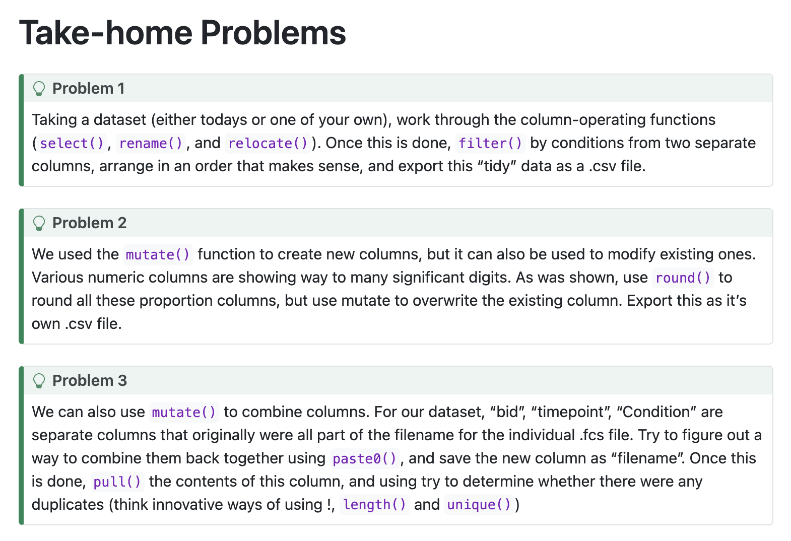

# Homework

Details can be found [here](https://umgcccfcsr.github.io/CytometryInR/course/04_IntroToTidyverse/)

See screenshot:
 

## Problem 1

Use select(), rename(), relocate(); then use filter()

We have Tcell count, CD45+ cell count, lymphocyte count. Calculate %T cells and %lymphocytes in CD45+ cells.  Subtract %Tcells from %Lymphocytes to indirectly calculate %B cells. 


```{r}
#had issues rendering if I didn't set the working directory (even tho it worked fine in the console)
setwd("/Users/chouse/Desktop/Positron/MyCytometryInRLearningFolder/Week4")
getwd()
File <-file.path("data","Dataset.csv")
Data<-read.csv(file = File, check.names = FALSE)

library(dplyr)
#use select()
Group<-c("bid","Date","timepoint","Condition","Tcells_count","lymphocytes_count","CD45_count")
#dplyr select function deprecated vector, need all_of()
TidyDataS<-Data |> select(all_of(Group))
#check dates run
TidyDataS |> select(all_of(Group)) |> pull(Date)
# change proportion to %, add new column with new name with this value
TidyDataS <- TidyDataS |> mutate(PercentTcellsofCD45postitiveCells = Tcells_count/CD45_count*100) |> mutate(PercentLymphocytesofCD45postitiveCells = lymphocytes_count/CD45_count*100) |> mutate(PercentBcellsofCD45positiveCells = PercentLymphocytesofCD45postitiveCells - PercentTcellsofCD45postitiveCells)

#use rename() to simplify name
TidyDataS<-TidyDataS |> rename(specimen=bid) |> rename(Tcells=PercentTcellsofCD45postitiveCells) |> rename(Bcells=PercentBcellsofCD45positiveCells) |> rename(lymphocytes=PercentLymphocytesofCD45postitiveCells)

#select
Calculated<- TidyDataS |> select(specimen, lymphocytes, Tcells, Bcells, Condition, timepoint)

#rearrange to see % first
Calculated<-Calculated |> relocate(Condition,.before = 1) |> relocate(timepoint,.before = 2) |> relocate(lymphocytes,.before=3) |> relocate(Tcells,.before = 4) |> relocate(Bcells,.before = 5)

#filter by conditions and arrange
Calculated<- Calculated|> filter(Condition %in% "Ctrl") |> filter(timepoint %in% 0)

#arrange
Calculated<- Calculated |> arrange(desc(lymphocytes))

#export
SimpleData <- paste0("SimplifiedDataset", ".csv")
Storage <- file.path("data", SimpleData)
write.csv(Calculated, Storage, row.names=FALSE)
```


## Problem 2

```{r}
#see Problem1 for Calculated dataset

#round data without making new columns using mutate and round
Calculated2<- Calculated |> mutate(lymphocytes = round(lymphocytes,2)) |> mutate(Tcells = round(Tcells,2)) |> mutate(Bcells = round(Bcells,2)) 
Calculated2

#export
SimpleData2 <- paste0("SimplifiedDatasetRound", ".csv")
Storage2 <- file.path("data", SimpleData2)
write.csv(Calculated2, Storage2, row.names=FALSE)
```

## Problem 3


```{r}
#see Problem1 for TidyDataS dataset

#combine bid (renamed above to specimen), timepoint, Condition
TidyDataSS <- TidyDataS |> mutate(filename = paste0(specimen, "_", timepoint, "_", Condition))

#pull new column, use unique identified non-duplicates so use !unique, or use length>1 to identify duplicates and unique to generate a list?

#fileName<- TidyDataSS |> pull(filename) |> !unique()  fails, is !unique() not allowed?
#fileName<- TidyDataSS |> pull(filename) |> length(!unique(filename)) 
#fileName<- TidyDataSS[!unique(TidyDataSS$filename),]

fileName<- TidyDataSS |> pull(filename) |> length()
uniqueName<- length(unique(TidyDataSS$filename))

#are the sizes the same?
fileName != uniqueName

#diplyr includes duplicate() to identify duplicated values 
duplicates<-TidyDataSS$filename[duplicated(TidyDataSS$filename)]
duplicates

#need to designate column here so can compare l
data_noduplicates<-TidyDataSS[!duplicated(TidyDataSS$filename),]
length(TidyDataSS$filename) != length(data_noduplicates$filename)

#diplyr includes distinct() which is like unique (keeps only first row), can do by certain column
uniquedata<- TidyDataSS |> distinct(filename, Bcells, .keep_all = TRUE)
length(TidyDataSS$filename) != length(uniquedata$filename)
```
